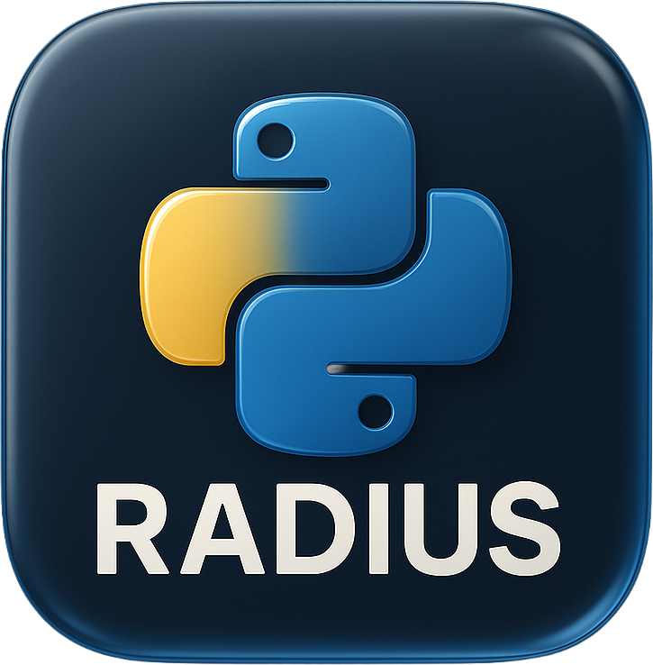

 

[](https://github.com/nicholasamorim/pyrad2/actions/workflows/python-test.yml)
[](https://www.python.org)
[](https://github.com/pre-commit/pre-commit)
[]([https://github.com/psf/black](https://github.com/astral-sh/uv))
[](http://mypy-lang.org/)

pyrad2 is an implementation of a RADIUS client/server as described in RFC2865 and of RADSEC client/server as described in RFC6614. It takes care of all the details like building RADIUS packets,sending them and decoding responses.

**Documentation can be found [here](https://nicholasamorim.github.io/pyrad2/).**

# Introduction

[pyrad2](https://github.com/nicholasamorim/pyrad2) is an implementation of a RADIUS client/server as described in RFC2865. It takes care of all the details like building RADIUS packets, sending them and decoding responses.

What this fork does differently from upstream [pyrad](https://github.com/pyradius/pyrad):
   
- Adds **RadSec** (RFC 6614) client and server (experimental)
- Adds **Status-Server** (RFC 5997) health checks across sync, async, and RadSec
- Adds **RFC 5080 §2.2.2 duplicate detection / response cache** — retransmitted Access/Accounting/CoA/Disconnect-Requests replay the cached reply bytes instead of re-running the handler, which is what keeps EAP `State` continuity intact and stops accounting double-counts
- Adds **Message-Authenticator** enforcement (validated whenever present, required for EAP, opt-in to require on every packet)
- Adds **CoA/Disconnect** (RFC 5176) handling with default NAK behavior + `Error-Cause` so unhandled requests are answered cleanly
- **Loads FreeRADIUS dictionaries** with broad fidelity: `ifid` (RFC 3162) and `ether` (RFC 6911) types, the `concat` attribute option (RFC 7268), the per-vendor `format=` directive (1/2/4-byte type fields, 0/1/2-byte length fields), RFC 6929 extended / long-extended attributes (types 241–246) with transparent fragmentation, and EVS (Extended-Vendor-Specific) via `BEGIN-VENDOR parent=` syntax
- Adds a `PYRAD2_TRACE=1` wire-level packet dump for every `request_packet` / `reply_packet` / `decode_packet`
- Adds [`scenarios/`](scenarios) — single-process end-to-end demos that show a full RADIUS exchange on one log
- Drops Python <3.12 and the `twisted` integration; converts the entire codebase to snake_case (see [Pyrad Compatibility](docs/compatibility.md))
- Extensive typing (mypy-clean) and significantly higher test coverage
- Numerous async-client bug fixes (retry/timeout correctness, EAP-MD5 parity with the sync client)

Note that this is _not_ a stand-alone Radius implementation like [FreeRadius](https://www.freeradius.org). You are supposed to inherit the server classes and code your own behind-the-scenes implementation. This package allows you to code your business logic on top of it.

# Requirements & Installation

pyrad2 requires Python 3.12 and uses [uv](https://github.com/astral-sh/uv). On a Mac, you can simply run `brew install uv`.

# Examples and scenarios

See the [Getting Started guide](https://nicholasamorim.github.io/pyrad2/setup/) for a better overview.

The repo ships two complementary surfaces depending on what you want:

- **[`examples/`](examples)** — operational scripts to **copy into your project** and edit. Server runs in one terminal, client in another. Targets: `make server`, `make auth`, `make server_radsec`, `make server_coa`, `make acct`, etc.
- **[`scenarios/`](scenarios)** — single-process end-to-end demos that run a server **and** client in one event loop. Not meant to be edited — they're runnable explanations of what a RADIUS flow looks like, top to bottom, on one log. This is the fastest way to learn what pyrad2 actually does.

```bash
make scenario_auth     # Access-Request → Access-Accept (UDP, RFC 2865)
make scenario_acct     # Accounting-Request → Accounting-Response
make scenario_coa      # CoA-Request → CoA-ACK (RFC 5176)
make scenario_status   # Status-Server health check (RFC 5997)
make scenario_dedup    # Duplicate detection / response cache (RFC 5080)
make scenario_radsec   # RadSec (RFC 6614) — mutual TLS, Access-Request
make demo              # all six sequentially
```

Set `PYRAD2_TRACE=1` on any script — scenario, example, or your own code — to dump every packet's wire bytes and decoded AVPs as they cross `request_packet` / `reply_packet` / `decode_packet`. Pair it with a scenario for a "watch a full RADIUS exchange one byte at a time" view:

```bash
PYRAD2_TRACE=1 make scenario_auth
```

# Tests

Run `make test`.

# Author, Copyright, Availability

pyrad2 is currently maintaned by Nicholas Amorim \<<nicholas@santos.ee\>.

pyrad was written by Wichert Akkerman \<<wichert@wiggy.net>\> and is
maintained by Christian Giese (GIC-de) and Istvan Ruzman (Istvan91).

This project is licensed under a BSD license.

Copyright and license information can be found in the LICENSE.txt file.

The current version and documentation can be found on pypi:
<https://pypi.org/project/pyrad2/>

Bugs and wishes can be submitted in the pyrad issue tracker on github:
<https://github.com/nicholasamorim/pyrad2/issues>
